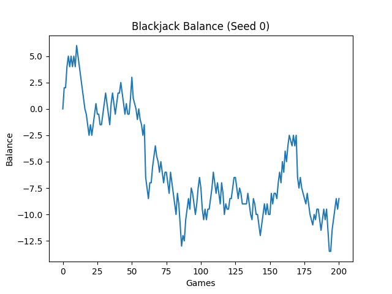

# Milestone 2 Writeup

### Describe your agent in terms of PEAS and give a background of your task at hand.
The task for this milestone was to create an agent that uses probabilistic concepts to determine the best five-letter words to guess in games of Wordle. The agent's performance measure is the amount of Wordle games that the agent wins. Its environment is a five-letter input space where the agent can input five-letter words and receive feedback for each letter. The agent's "actuators" choose the five-letter word that maximizes the amount of information we need to find the answer word. The agent's "sensors" sense the feedback that the game gives for its guesses (whether a letter is i not in the word, in the word but in a different place, or correct).

### Give an exploration of your dataset, and highlight which variables are important. Give a brief overview of each variable and its role in your agent/model. (Draw a picture!!)
We have two collections of words: the words in `wordle_word_list.txt` is the set of all valid five-letter words that a player can guess in Wordle, and the words in `wordle_sol_list.txt` is the set of all possible five-letter answers that Wordle can choose for games (unless the `Wordle` game is set to `hard` mode, in which it can choose any word from `wordle_word_list.txt`).
Our dataset is generated in `precompute_feedback` in `wordle_utils.py`; this function loops through all possible 5-letter words (found in `wordle_word_list.txt`), using each one as a guess against every possible 5-letter word and obtaining the feedback for the guess using `get_feedback`. The function saves all of these observations to `feedback_matrix.npy`, which is used to calculate our parameters.

The primary variables are the word we are trying to guess (**W**), the guesses that the agent makes (**G_i**), and the feedback that the game gives for each guess (**F_i**). Our **W** variable serves as the goal of our model, our **G_i** variables are the model's actions, and the **F_i** variables are the information that the model uses to make better decisions. These variables and their relationships are shown in the diagram below:

### Describe in detail how your variables interact with each other, and if your model fits a particular structure, explain why you chose that structure to model your agent. If it does not, further elaborate on why you chose that model based on the variables.
At the start of each game, our target five-letter word **W** is chosen at random (unless explicitly chosen using the `const_word` parameter in our `Wordle` game) and influences our **F_i** variables by determining how accurate each guess is. Each action our agent makes is a **G_i** variable (a five-letter word); for all i from 1 to 6 (since we have 6 total guesses), **G_i** influences **F_i** because the feedback reflects how accurate the guess is in comparison to the answer word. Once our agent guesses, the game computes the **F_i** variable, a list of five integers (0 = letter is not in the word, 1 = letter is in the word but in a different place, 2 = letter is correct). For all i from 1 to 5 (we exclude 6 since that is our final guess, so the game is over), **F_i** influences **G_{i+1}** because the feedback narrows down the words that could possibly be the answer, meaning **G_{i+1}** will only be a word from this subset of possible words.

### Describe your process for calculating parameters in your model. That is, if you wish to find the CPTs, provide formulas as to how you computed them. If you used algorithms in class, just mention them.
Our model computes its parameters in `wordle_bot.py`, where it chooses its next guess in the `action` function. This function first filters `self.remaining_index` (the indices of the possible answer words) to only include possible answer words that fit the given guess history (the feedback we have received for past guesses) to narrow down the number of relevant observations to consider. Next, it calls `evaluate_words`, which loops through all possible 5-letter words (found in `wordle_word_list.txt`), calling `get_information` on each one, and returns the index of the word that gives us the most information in finding the answer word. (Note: To reduce runtime, we always choose the word "tarse" as our first guess as this is what our bot would choose every game if we didn't hardcode it.)

The function `get_information` is where the calculations primarily happen. For the given word (index), the model guesses it against all possible answer words (`self.remaining_index`) by obtaining the feedback for each answer from `self.lookup` (our database in `feedback_matrix.py`). We count up the number of each possible feedback (i.e. each possible five-letter list of 0s, 1s, and 2s) that occurs. We multiply each count by the frequency of the word guess in an English corpus (`self.frequencies`). Note that for this assignment we take a simplistic approach by setting the frequency equal to 4 if the word guess is in `wordle_sol_list.txt` and 1 otherwise. We normalize all of these counts by dividing by the total frequency of all words in `self.remaining_index`. This calculation is modeled in equation (1) in the picture below. Once these parameters are calculated, we find how much information the word guess gives by calculating the entropy, an equation from class modeled in equation (2). Our model chooses the word guess that returns the highest entropy.

### END OF NEW README, WILL ADD MORE LATER

### Train your first model
**Update:** Our model's functionality is found in data_bot.py, particularly in the `action` function. It generates a large number of decks using `__generate_decks`, where each deck is a shuffled version of the unseen cards in the current game state. For each shuffled deck, the model calculates the expected value for all possible action in the `analyze` function. The `analyze` function does this by running the respective function for each action other than surrender (`hit` for hitting, `stand` for standing, etc), where each function returns the expected value of performing that action on the given deck. Running `analyze` on all these shuffled decks creates our observations. The expected values are summed across these observations and divided by `num_decks` to find the final expected values for each action. The model incorporates the diagram above by choosing the action with the most observations resulting in a win, i.e. the action with the highest expected value. **(end of update)**

### Evaluate your model
**Update:** Our model can be evaluated by running data_bot_sim.py, particularly the `simulate` function. For each game, the model chooses the best action (based on the logic described above) repeatedly until either the player or dealer wins. The result of the game determines what is added to or subtracted from the player's balance. This continues for a user-specified number of games, and a plot showing the player's balance over time is created when all games have been played. **(end of update)**

### Create/Update your README.md to include your new work and updates you have all added. Make sure to upload all code and notebooks. Provide links in your README.md
The following are the main scripts that we implemented throughout the process of building our agent (in chronological order):
- [blackjack.py](https://github.com/VinnieMuffinMan/CSE-150A-Project/blob/Milestone2/blackjack.py): This contains the Blackjack class that our agent interacts with to play the game.
- [bj_utils.py](https://github.com/VinnieMuffinMan/CSE-150A-Project/blob/Milestone2/bj_utils.py): This contains utility functions for our game. So far we have a score function that determines the score of a hand.
- [state.py](https://github.com/VinnieMuffinMan/CSE-150A-Project/blob/Milestone2/state.py): This contains the State class that stores the current game state, i.e. the player hand, the dealer hand, and the cards we have not yet seen (for card counting).
- [bot.py](https://github.com/VinnieMuffinMan/CSE-150A-Project/blob/Milestone2/bot.py): This bot chooses the player's action based on ideal probabilities i.e. not on observations. We would use this to compare with our data-driven agent and determine its accuracy.
- [test.py](https://github.com/VinnieMuffinMan/CSE-150A-Project/blob/Milestone2/test.py): This test file ensures that our bot in bot.py outputs the correct expected values.
- [main.py](https://github.com/VinnieMuffinMan/CSE-150A-Project/blob/Milestone2/main.py): This file compares the accuracy of our agent to the bot in bot.py.
- [data_bot.py](https://github.com/VinnieMuffinMan/CSE-150A-Project/blob/Milestone2/data_bot.py): This contains our utility-based agent which generates the dataset of observations and chooses the action that maximizes earnings based on these observations.
- [data_bot_sim.py](https://github.com/VinnieMuffinMan/CSE-150A-Project/blob/Milestone2/data_bot_sim.py): This simulates games for our agent to show its performance measure by outputting the agent's balance after a given number of games.

### Conclusion section: What is the conclusion of your 1st model? What can be done to possibly improve it?
**Update:** Our model is evaluated by the player's balance after a number of games, a higher balance indicating better performance (a positive final balance would be ideal). Overall, the model performed decently but could definitely be improved as evidenced by the negative balance after 200 games as shown in the graph below:

The model did well with making the right decisions: we compared the expected values for each decision that it calculated with those calculated in bot.py (which finds the true expected values) and found that they often agreed on which action had the highest expected value. The model also did well with generating observations, only considering those that match the current game state so that it rejects irrelevant data. However, the model is limited by the number of observations it generates and its lack of variable betting, causing it to perform suboptimally. Improving the model would most likely involve generating more observations to increase the precision of expected values as well as adding some kind of variable betting to allow for more advantage play. **(end of update)**