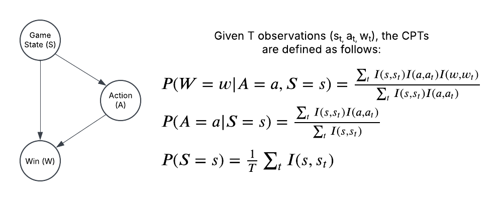

# Milestone 2 Writeup

[UPDATED DIAGRAM](#describe-how-your-agent-is-set-up-and-where-it-fits-in-probabilistic-modeling) 
[UPDATED EXPLANATION OF MODEL](#train-your-first-model) 
[UPDATED EVALUATION OF MODEL](#evaluate-your-model) 
[UPDATED CONCLUSION](#conclusion-section-what-is-the-conclusion-of-your-1st-model-what-can-be-done-to-possibly-improve-it)

### Explain what your AI agent does in terms of PEAS. What is the "world" like?
The world that the AI agent resides is where the agent is a Blackjack player that aims to maximize their earnings (the performance measure). The world uses an 8-deck size shoe and for each game, it randomly chooses starting hands from this shoe for the dealer and our agent (the environment). Our agent's "sensors" sense the current game state, which consists of the dealer's visible card, the agent's hand, and the cards that we haven't seen based on previous games (i.e. our agent incorporates card counting). Based on the current game state and a large number of observations relevant to that state (i.e. our dataset), the agent's "actuators" chooses the optimal move (hit, stand, double, split, or surrender).

### What kind of agent is it? Goal based? Utility based? etc.
Our agent is utility based because it chooses the most effective options in achieving the goal of maximizing earnings.

### Describe how your agent is set up and where it fits in probabilistic modeling
**Update:** The agent is set up according to the network below: 

The state variable is the current game state (which consists of the dealer's hand, the player's hand, and the remaining cards in the deck). The action variable is what the player chooses to do (hit, stand, double, split, surrender). The win variable is a binary node where 1 indicates the player wins the game and 0 indicates the player loses. 
The state variable influences the action variable by determining which action is most likely to result in a win: 
- The dealer's hand tells the player what the dealer's score could most likely be, indicating whether the player should play against that hand.
- The player's hand tells the player what the player's score could most likely be, indicating whether the player should stand or take further action.
- The remaining cards in the deck tells the player what possible cards the dealer or player can draw, indicating what either hand could possibly be. 

The state and action variables affect the win variable by determining how the game plays out. The state can indicate what either hand could possibly be, and the action could either increase or decrease the chances of winning.
This network is modeled in the `action` function, which takes the current game state as input and generates a large number of possible decks that match the not-seen cards in the state. From this set of possible decks, it creates a dataset of observations by performing possible actions on the deck (hit, stand, etc) and recording their outcomes. The agent chooses the action A that maximizes the chance of winning a game, i.e. the action with the most observations where the player won (the first probability listed in our diagram). Note that this probability is also conditioned on the current game state and thus we only generate observations that are based on this game state, as generating observations proved to be very inefficient. **(end of update)**

### Train your first model
**Update:** Our model's functionality is found in data_bot.py, particularly in the `action` function. It generates a large number of decks using `__generate_decks`, where each deck is a shuffled version of the unseen cards in the current game state. For each shuffled deck, the model calculates the expected value for all possible action in the `analyze` function. The `analyze` function does this by running the respective function for each action other than surrender (`hit` for hitting, `stand` for standing, etc), where each function returns the expected value of performing that action on the given deck. Running `analyze` on all these shuffled decks creates our observations. The expected values are summed across these observations and divided by `num_decks` to find the final expected values for each action. The model incorporates the diagram above by choosing the action with the most observations resulting in a win, i.e. the action with the highest expected value. **(end of update)**

### Evaluate your model
**Update:** Our model can be evaluated by running data_bot_sim.py, particularly the `simulate` function. For each game, the model chooses the best action (based on the logic described above) repeatedly until either the player or dealer wins. The result of the game determines what is added to or subtracted from the player's balance. This continues for a user-specified number of games, and a plot showing the player's balance over time is created when all games have been played. **(end of update)**

### Create/Update your README.md to include your new work and updates you have all added. Make sure to upload all code and notebooks. Provide links in your README.md
The following are the main scripts that we implemented throughout the process of building our agent (in chronological order):
- [blackjack.py](https://github.com/VinnieMuffinMan/CSE-150A-Project/blob/Milestone2/blackjack.py): This contains the Blackjack class that our agent interacts with to play the game.
- [bj_utils.py](https://github.com/VinnieMuffinMan/CSE-150A-Project/blob/Milestone2/bj_utils.py): This contains utility functions for our game. So far we have a score function that determines the score of a hand.
- [state.py](https://github.com/VinnieMuffinMan/CSE-150A-Project/blob/Milestone2/state.py): This contains the State class that stores the current game state, i.e. the player hand, the dealer hand, and the cards we have not yet seen (for card counting).
- [bot.py](https://github.com/VinnieMuffinMan/CSE-150A-Project/blob/Milestone2/bot.py): This bot chooses the player's action based on ideal probabilities i.e. not on observations. We would use this to compare with our data-driven agent and determine its accuracy.
- [test.py](https://github.com/VinnieMuffinMan/CSE-150A-Project/blob/Milestone2/test.py): This test file ensures that our bot in bot.py outputs the correct expected values.
- [main.py](https://github.com/VinnieMuffinMan/CSE-150A-Project/blob/Milestone2/main.py): This file compares the accuracy of our agent to the bot in bot.py.
- [data_bot.py](https://github.com/VinnieMuffinMan/CSE-150A-Project/blob/Milestone2/data_bot.py): This contains our utility-based agent which generates the dataset of observations and chooses the action that maximizes earnings based on these observations.
- [data_bot_sim.py](https://github.com/VinnieMuffinMan/CSE-150A-Project/blob/Milestone2/data_bot_sim.py): This simulates games for our agent to show its performance measure by outputting the agent's balance after a given number of games.

### Conclusion section: What is the conclusion of your 1st model? What can be done to possibly improve it?
**Update:** Our model is evaluated by the player's balance after a number of games, a higher balance indicating better performance (a positive final balance would be ideal). Overall, the model performed decently but could definitely be improved as evidenced by the negative balance after 200 games as shown in the graph below:

The model did well with making the right decisions: we compared the expected values for each decision that it calculated with those calculated in bot.py (which finds the true expected values) and found that they often agreed on which action had the highest expected value. The model also did well with generating observations, only considering those that match the current game state so that it rejects irrelevant data. However, the model is limited by the number of observations it generates and its lack of variable betting, causing it to perform suboptimally. Improving the model would most likely involve generating more observations to increase the precision of expected values as well as adding some kind of variable betting to allow for more advantage play. **(end of update)**