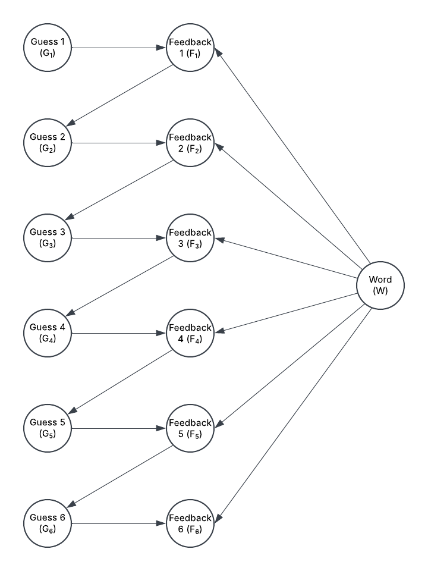
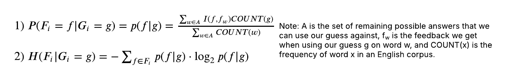
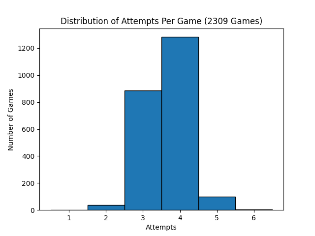

# Milestone 3 Writeup

## PEAS/Agent Analysis
### Describe your agent in terms of PEAS and give a background of your task at hand.
The task for this milestone was to create an agent that uses probabilistic concepts to determine the best five-letter words to guess in games of Wordle. The agent's performance measure is the amount of Wordle games that the agent wins. Its environment is a five-letter input space where the agent can input five-letter words and receive feedback for each letter. The agent's "actuators" choose the five-letter word that maximizes the amount of information we need to find the answer word. The agent's "sensors" sense the feedback that the game gives for its guesses (whether a letter is i not in the word, in the word but in a different place, or correct).

## Agent Setup, Data Preprocessing, Training setup
### Give an exploration of your dataset, and highlight which variables are important. Give a brief overview of each variable and its role in your agent/model. (Draw a picture!!)
We have two collections of words: the words in `wordle_word_list.txt` is the set of all valid five-letter words that a player can guess in Wordle, and the words in `wordle_sol_list.txt` is the set of all possible five-letter answers that Wordle can choose for games (unless the `Wordle` game is set to `hard` mode, in which it can choose any word from `wordle_word_list.txt`).All words in `wordle_sol_list.txt` are from [here](https://gist.github.com/slushman/34e60d6bc479ac8fc698df8c226e4264), and all words in `wordle_word_list.txt` are from [here](https://gist.github.com/dracos/dd0668f281e685bad51479e5acaadb93).

Our dataset is generated in `precompute_feedback` in `wordle_utils.py` (which can be found [here](https://github.com/VinnieMuffinMan/CSE-150A-Project/blob/Milestone3/wordle_utils.py)); this function loops through all possible 5-letter words (found in `wordle_word_list.txt`), using each one as a guess against every possible 5-letter word and obtaining the feedback for the guess using `get_feedback`. The feedback for a given guess is a list of five integers from 0 to 2, where 0 = letter is not in the word, 1 = letter is in the word but in a different place, and 2 = letter is correct. Thus, each observation is a possible guess, a possible answer, and the feedback given when using the guess on that answer. The function saves all of these observations to `feedback_matrix.npy`, which is used to calculate our parameters. (Note: If you do not yet have `feedback_matrix.npy`, run `precompute_feedback` once before running anything else.)

The primary variables are the word we are trying to guess (**W**), the guesses that the agent makes (**G_i**), and the feedback that the game gives for each guess (**F_i**). Our **W** variable serves as the goal of our model, our **G_i** variables are the model's actions, and the **F_i** variables are the information that the model uses to make better decisions. These variables and their relationships are shown in the diagram below:

### Describe in detail how your variables interact with each other, and if your model fits a particular structure, explain why you chose that structure to model your agent. If it does not, further elaborate on why you chose that model based on the variables.
At the start of each game, our target five-letter word **W** is chosen at random (unless explicitly chosen using the `const_word` parameter in our `Wordle` game) and influences our **F_i** variables by determining how accurate each guess is. Each action our agent makes is a **G_i** variable (a five-letter word); for all i from 1 to 6 (since we have 6 total guesses), **G_i** influences **F_i** because the feedback reflects how accurate the guess is in comparison to the answer word. Once our agent guesses, the game computes the **F_i** variable, a list of five integers (0 = letter is not in the word, 1 = letter is in the word but in a different place, 2 = letter is correct). For all i from 1 to 5 (we exclude 6 since that is our final guess, so the game is over), **F_i** influences **G_{i+1}** because the feedback narrows down the words that could possibly be the answer, meaning **G_{i+1}** will only be a word from this subset of possible words.

### Describe your process for calculating parameters in your model. That is, if you wish to find the CPTs, provide formulas as to how you computed them. If you used algorithms in class, just mention them.
The function `get_information` is where the calculation of our parameters primarily happen. For the given word (index), the model guesses it against all possible answer words (`self.remaining_index`) by obtaining the feedback for each answer from `self.lookup` (our database in `feedback_matrix.py`). We count up the number of each possible feedback (i.e. each possible five-letter list of 0s, 1s, and 2s) that occurs. We multiply each count by the frequency of the word guess in an English corpus (`self.frequencies`). Note that for this assignment we take a simplistic approach by setting the frequency equal to 4 if the word guess is in `wordle_sol_list.txt` and 1 otherwise. We normalize all of these counts by dividing by the total frequency of all words in `self.remaining_index`. This calculation is modeled in equation (1) in the picture below. Once these parameters are calculated, we find how much information the word guess gives by calculating the entropy, an equation from class modeled in equation (2). Our model chooses the word guess that returns the highest entropy.

## Train your model!
### Be sure to link to a clean, documented portion of code in your notebook or provide a code snippet in the README.
Our model is trained in `wordle_bot.py`, where it chooses its next guess in the `action` function. This function first filters `self.remaining_index` (the indices of the possible answer words) to only include possible answer words that fit the given guess history (the feedback we have received for past guesses) to narrow down the number of relevant observations we need to consider. Next, it calls `evaluate_words`, which loops through all possible 5-letter words (found in `wordle_word_list.txt`), calling `get_information` on each one, and returns the index of the word that gives us the most information in finding the answer word. (Note: To reduce runtime, we always choose the word "tarse" as our first guess as this is what our bot would choose every game if we didn't hardcode it.) For more information on our model, see [wordle.py](https://github.com/VinnieMuffinMan/CSE-150A-Project/blob/Milestone3/wordle_bot.py).

## Conclusion/Results
### Describe in detail your results, including any helpful visualizations like heatmaps, confusion matrices, etc. (if applicable). Please provide numerical results (unless your model's performance metrics do not include numbers).
We evaluated our model in `wordle_sim.py` (which can be found [here](https://github.com/VinnieMuffinMan/CSE-150A-Project/blob/Milestone3/wordle_sim.py)), in which we use the `simulate` function to have our model play a game of Wordle. We had the model play Wordle for all 2309 words in `wordle_sol_list.txt` and recorded the number of attempts per game. We found that our model has a 100% win rate (it guesses each word in 6 attempts or less) with an average of 3.63 attempts per game. The distribution of the number of attempts for each game is modeled in the bar graph below. Based on our results, our model performs very well, as it always successfully gets the answer and rarely needs more than 4 attempts to do so.

### Propose various points of improvement for your model, and be thorough! Do not just say "we could use more data", or "I'll be sure to use reinforcement learning for the next milestone so we can better model our objective." Carefully work through your data preprocessing, your training steps, and point out any simplifications that may have impacted model performance, or perhaps any potential errors or biases in the dataset. You are not required to implement these points of improvement unless it is clear that your original model is significantly lacking in detail or effort.
One point of improvement in data preprocessing would be to implement multiprocessing in the `precompute_feedback` function in order to generate `feedback_matrix.py` faster. Though this dataset only needed to be generated once before evaluation, it took a significant amount of time and could definitely be sped up. A point of improvement in our training step would be to reduce the list of words that we guess in `evaluate_words`, since it is most likely not entirely necessary to calculate the parameters of every possible word. This would be done most likely by running `fits_info` on the words in `self.guessable_index` so that we only consider possible guesses that fit our previous feedback.

Another point of improvement in the training step would be to replace the simplistic approach to word frequency in our model with the use of an actual dataset of word frequencies. The problem with our approach lied in the fact that giving all words in `wordle_sol_list.txt` an equal weight removes the nuance that some of those words are much more frequent in English corpuses than others and therefore should be given more weight. This would allow our model to show preference to words that are more frequent in the English language and thus more likely to be Wordle answers.